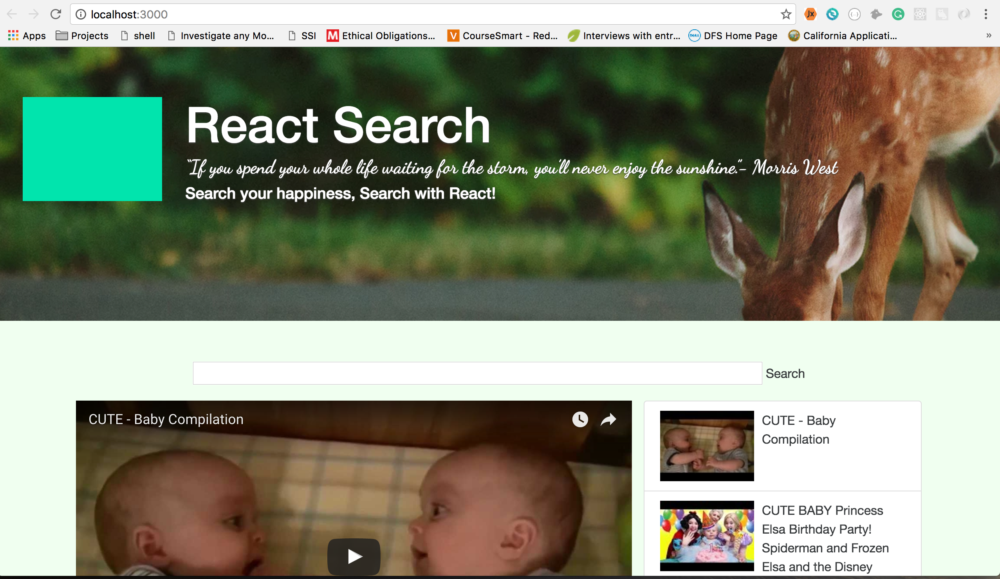
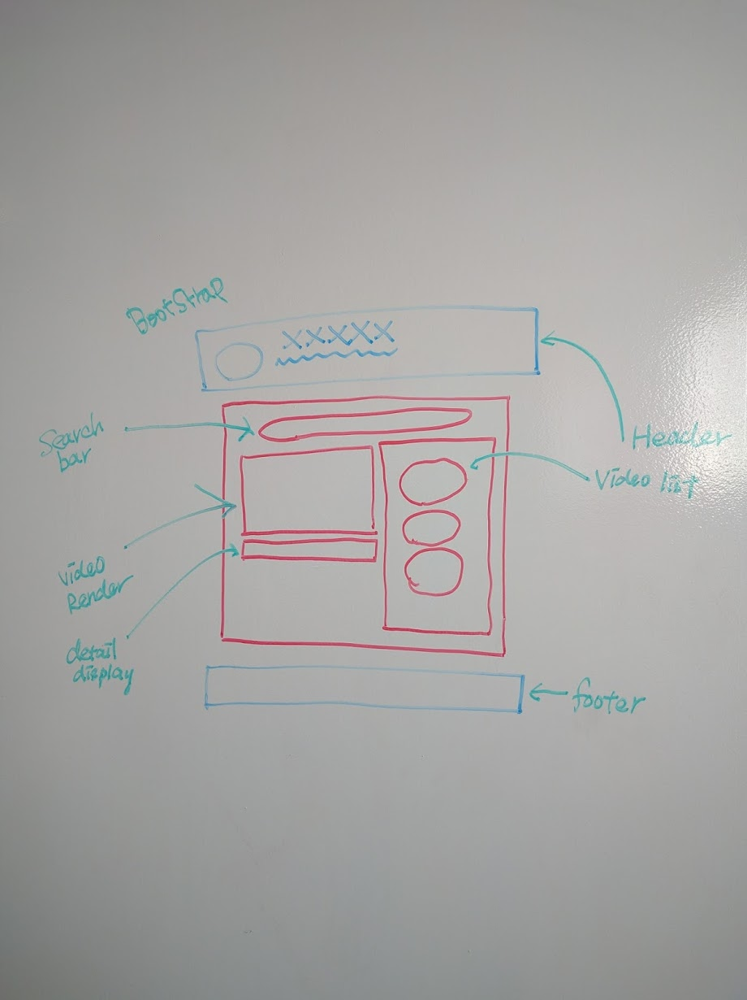

#Final Project 

####***“If you spend your whole life waiting for the storm, you’ll never enjoy the sunshine.”-***
Morris West

####Find your happiness, Search with React!



##React Search
It is a you-tube base API search engine, which will able you to search your happiness. You will be able to search anything on React Search.

##Motivation
The purpose of this project is to demonstrate the efficiency of Reactjs. In Addition, I want to make a video search engine, which will let you search videos. The only different between React Search and Youtube is that we advise our user to search positive and search to your happiness. The default page is set to cute baby, because cute baby always bring happiness to me. And I would like to use these cute babies to bring happiness to our users. 

##Planning Process
###wireframe

###[Trello](https://trello.com/b/AOkumB4u/final-project-react-search)

You tube API
```
npm install --save youtube-api-search
```

Languages:

* React
* HTML
* CSS
* ES6 
* Jquery
* JSX

Complier

* Babel

Frameworks:

* Bootstrap

##Piece of Code

######JSX, ES6 and the Constructor function:
#####I feel that the most diffcult part is the constructor function initializing the state and list of the videos to display.

```
const App = function(){   //JSX
  return<div>hi</div>
}


"use strict";       //Without JSX

var App = function App() {
  return React.createElement(
    "div",
    null,
    "hi"
  );
};
```

```
import React,{ Component } from 'react'; //ES6
const Component = React.Component

class SearchBar extends React.Component {
    render() { return<input />} //JSX
}
```


```
class App extends Component {
  constructor(props) {
    super(props);

    this.state = {     //Initialize State
      videos: [],      //List of Video
      selectedVideo: null
   };
   this.videoSearch('cutebaby'); //Default
}
  videoSearch(term) {
     YTSearch({key: API_KEY, term: term}, (videos) => {
        this.setState({       //update video
          videos: videos,
          selectedVideo: videos[0]
      });
    });
  }
```
